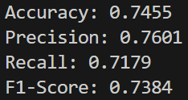
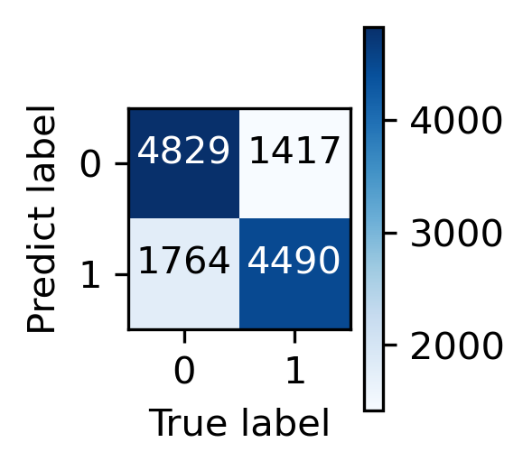
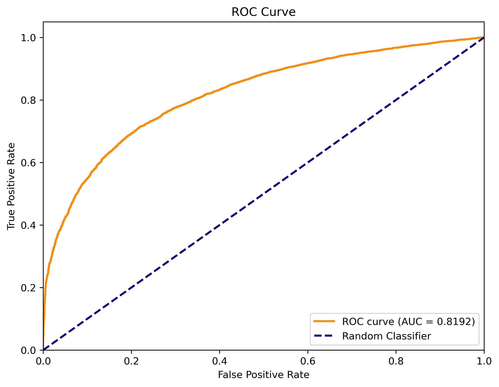
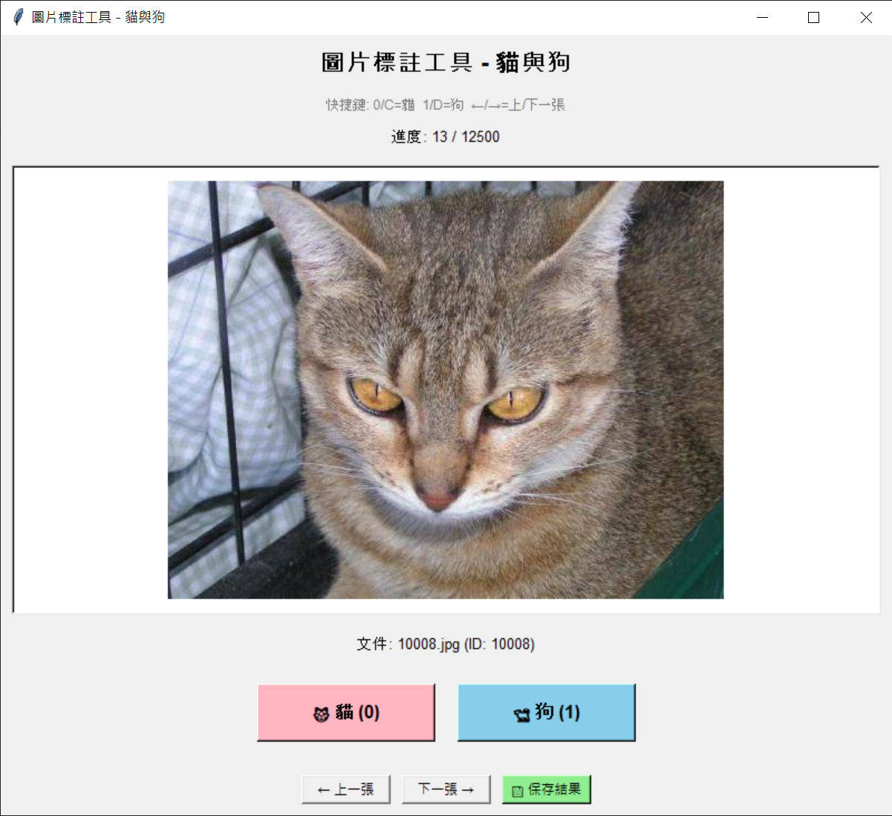

# Cats And Dogs classification
# Dataset
* [Kaggle public dataset](https://www.kaggle.com/competitions/dogs-vs-cats/data)
* test1 dataset has no corresponding label, so I labeling the test1 dataset by myself, labeling result saved in test1_label.csv
# Run codes
* train
```bash
python ./train.py
```
* inference
```bash
python ./inference.py --model_path='model path of trained model'
```
* Colab version ([Link](https://drive.google.com/drive/folders/1FAFm_mdD7G__4qXRhR1Qfhu01iTz2-lJ?usp=drive_link))
    * I upload all ingredient up to my google drive in order to train model in colab
    * Run all the blocks in colab to train the model and do the inference
    * Remember to **mount the drive** into colab to ensure data accessment from my google drive 
# Codes
```text
CatsAndDogs/
├── dogs-vs-cats/           # Folder containing dataset
|
├── models/                 # Folder save trained models
|
├── data_preprocess.py      # Data preprocessing
|
├── image_labeler_gui.py    # Image labeling tools
|
├── model.py                # Model architecture definition
|
├── train.py                # Model training procedure
|
└── README.md
```
# Demo
* Result  


* Confusion matrix 


* ROC curve 


* Labeling tools 


# Package version
```bash
python==3.8
torch==1.13.1+cu116
torchversion==0.14.1+cu116
torchinfo==1.8.0
scikit-learn==1.0.2
tqdm==4.63.1
rich==13.5.2
```